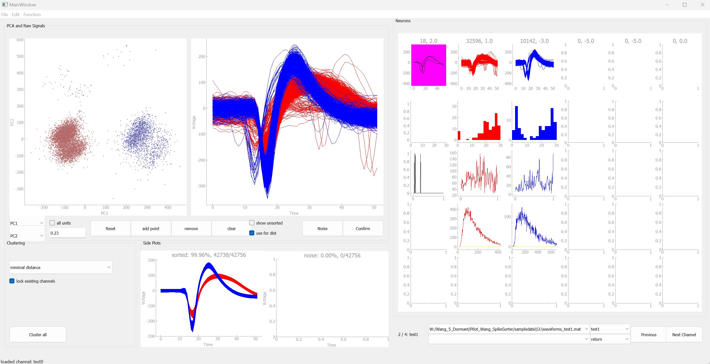

# WangGit_Pilot_SpikeSorter

This is a custom spike sorter written by Siyu. It's intended for flexible manual sorting of multi-electrode chronic array recordings. It can display the same channel across multiple recording sessions, and have flexible selection tools. 

For questions, please email wangxsiyu@gmail.com
